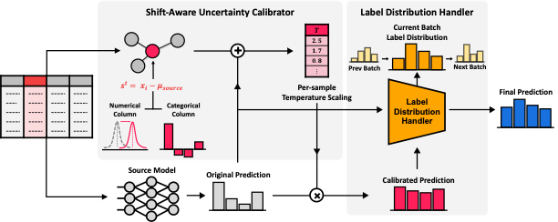

# AdapTable: Test-Time Adaptation for Tabular Data via Shift-Aware Uncertainty Calibrator and Label Distribution Handler (NeurIPSW-TRL 2024)
[](https://arxiv.org/abs/2407.10784)


## Introduction
[**AdapTable: Test-Time Adaptation for Tabular Data via Shift-Aware Uncertainty Calibrator and Label Distribution Handler**](https://openreview.net/forum?id=yhD2icebZ0)<br>
Changhun Kim*, Taewon Kim*, Seungyeon Woo, June Yong Yang, Eunho Yang (*: equal contribution)<br>
NeurIPS Workshop on Table Representation Learning (NeurIPSW-TRL), 2024



<div style="text-align: justify;">
<b>Abstract:</b> In real-world scenarios, tabular data often suffer from distribution shifts that threaten the performance of machine learning models. Despite its prevalence and importance, handling distribution shifts in the tabular domain remains underexplored due to the inherent challenges within the tabular data itself. In this sense, test-time adaptation (TTA) offers a promising solution by adapting models to target data without accessing source data, crucial for privacy-sensitive tabular domains. However, existing TTA methods either 1) overlook the nature of tabular distribution shifts, often involving label distribution shifts, or 2) impose architectural constraints on the model, leading to a lack of applicability. To this end, we propose AdapTable, a novel TTA framework for tabular data. AdapTable operates in two stages: 1) calibrating model predictions using a shift-aware uncertainty calibrator, and 2) adjusting these predictions to match the target label distribution with a label distribution handler. We validate the effectiveness of AdapTable through theoretical analysis and extensive experiments on various distribution shift scenarios. Our results demonstrate AdapTable’s ability to handle various real-world distribution shifts, achieving up to a 16% improvement on the HELOC dataset. Our code is available at https://github.com/drumpt/AdapTable.
</div>


## Environmental Setup
```
conda create -n adaptable python=3.8.16 -y
conda activate adaptable
pip install -r requirements.txt
```


## Run
- edit conf/config.yaml properly.
- To run adaptable, run the following:
```
python main.py \
    benchmark=tableshift \
    dataset=heloc \
    shift_type=None \
    shift_severity=1 \
    --config-name ours_mlp.yaml
```


## Contact
If you have any questions or comments, feel free to contact us via changhun.kim@kaist.ac.kr.


## Citation
```
@inproceedings{kim2024adaptable,
  title={{AdapTable: Test-Time Adaptation for Tabular Data via Shift-Aware Uncertainty Calibrator and Label Distribution Handler}},
  author={Kim, Changhun and Kim, Taewon and Woo, Seungyeon and Yang, June Yong and Yang, Eunho},
  booktitle={NeurIPS Workshop on Table Representation Learning (NeurIPSW-TRL)},
  year={2024}
}
```
